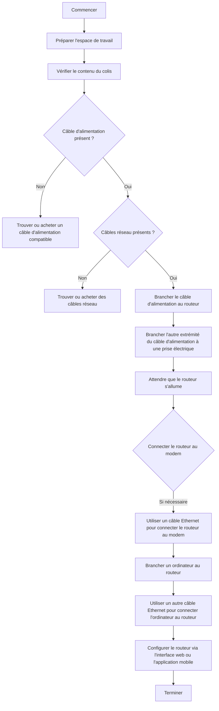

**Jonathan Contribut** -  **Eval Complements**

---

**Question 1** : 
- Le leadership de CISCO sur le marché des équipements réseau signifie que les professionnels IT ayant des compétences dans l'administration de matériel CISCO sont très demandés, améliorant ainsi leur employabilité.

**Question 2** : Expliquer comment brancher un routeur Cisco.

