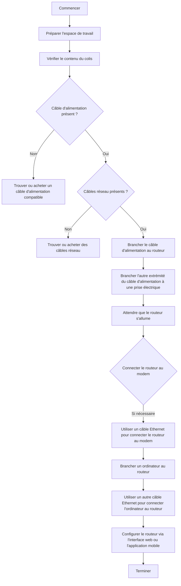

**Jonathan Contribut** -  **Eval Complements**

---

**Question 1** : 
- Le leadership de CISCO sur le marché des équipements réseau signifie que les professionnels IT ayant des compétences dans l'administration de matériel CISCO sont très demandés, améliorant ainsi leur employabilité.

**Question 2** : Expliquer comment brancher un routeur Cisco.



**Exercice  3** : Expliquer en pas à pas comment installer et lancer une VM Windows Serveur.

- Etape 1 : Lancer **Virtual Box**
- Etape 2 : Réaliser les taches suivantes : -> `Cliquer sur nouvelle machine` -> `Taper la commande suivante` :
```powershell
# Création des utilisateurs JLeBlanc et FPignon avec le mot de passe "M02p@ss3"
New-LocalUser -Name "JLeBlanc" -FullName "Jean LeBlanc" -Description "Utilisateur JLeBlanc" -Password (ConvertTo-SecureString "M02p@ss3" -AsPlainText -Force)
New-LocalUser -Name "FPignon" -FullName "François Pignon" -Description "Utilisateur FPignon" -Password (ConvertTo-SecureString "M02p@ss3" -AsPlainText -Force)

# Création des groupes SysUsers et SysGroupes
New-LocalGroup -Name "SysUsers" -Description "Groupe des utilisateurs système"
New-LocalGroup -Name "SysAdmins" -Description "Groupe des groupes système"

# Ajout des utilisateurs aux groupes
Add-LocalGroupMember -Group "SysUsers" -Member "FPignon"
Add-LocalGroupMember -Group "SysAdmins" -Member "JLeBlanc"
```
Cette commande permet de créer des utilisateurs à la chaine.

---

## Configuration du DHCP : 
- Script pour créer un serveur DHCP, ne pas hésiter à modifer pour correspondre aux divers situations.

```powershell
# Mettre à jour le système et installer le rôle DHCP
Write-Output "Mise à jour le système et installation du rôle DHCP..."
$installResult = Install-WindowsFeature -Name DHCP -IncludeManagementTools

# Vérifier si le redémarrage est nécessaire
if ($installResult.RestartNeeded -eq "Oui") {
    Write-Output "Un redémarrage est nécessaire pour terminer l'insatallation. Le serveur va redémarrer..."
    # Renommer le serveur en "SRV-DHCP" avant de redémarrer
    Rename-Computer -NewName "SRV-DHCP" -Force
    # Le script s'arrête ici, et vous devez redémarrer manuellement le serveur
    Restart-Computer
    exit
}

# ************************************************** #

# Importation du module DHCP
Import-Module DhcpServer

# Vérification de l'installation du rôle DHCP
if (!(Get-WindowsFeature DHCP -ErrorAction Stop)) {
    Write-Error "Le rôle DHCP n'est pas installé"
    Exit 1
}

# Configuration des variables pour la nouvelle étendue DHCP
$ScopeStartAddress = "192.168.1.50"
$ScopeEndAddress = "192.168.1.254"
$ScopeSubnetMask = "255.255.255.0"
$DefaultGateway = "192.168.1.1"
$PrimaryDNSServer = "192.168.1.2"
$SecondaryDNSServer = "8.8.8.8"
$LeaseDuration = New-TimeSpan -Hours 8
$ExclusionRangeBegin = "192.168.1.200"
$ExclusionRangeEnd = "192.168.1.210"
$DnsDomainName = "exemple.local"
$ScopeId = @(, $ScopeStartAddress, $ScopeSubnetMask)


# Création d'une nouvelle étendue DHCP
try {
    Add-DhcpServerv4Scope -Name "LAN-Scope" -StartRange $ScopeStartAddress -EndRange $ScopeEndAddress -SubnetMask $ScopeSubnetMask
}
catch {
    Write-Error $_.Exception.Message
    Exit 1
}


# Configuration des options d'étendue DHCP
try {
    Set-DhcpServerv4OptionValue -ScopeId $ScopeId -Router $DefaultGateway -DnsServer $PrimaryDNSServer, $SecondaryDNSServer -DnsDomainName $DnsDomainName
}
catch {
    Write-Error $_.Exception.Message
    Exit 1
}


# Configuration de la durée du bail d'adresse IP
try {
    Set-DhcpServerv4Scope -ScopeId $ScopeStartAddress -LeaseDuration $LeaseDuration
}
catch {
    Write-Error $_.Exception.Message
    Exit 1
}


# Ajout d'une plage d'adresses IP exclues
try {
    Add-DhcpServerv4ExclusionRange -ScopeId $ScopeStartAddress -StartRange $ExclusionRangeBegin -EndRange $ExclusionRangeEnd
}
catch {
    Write-Error $_.Exception.Message
    Exit 1
}


# Sauvegarde de la base de données DHCP
try {
    Backup-DhcpServer -Path "$env:USERPROFILE\Documents\DHCP_Backup"
    Write-Output "La sauvegarde de la base de données DHCP a été sauvegardée avec succès"    
}
catch {
    Write-Error "La sauvegarde de la base de données DHCP à échoué : $_.Exception.message"
    Exit 1    
}


# Confirmation de la configuration
try {
    $ScopeConfig = Get-DhcpServerv4Scope -ScopeId $ScopeStartAddress
    Write-Output "Configuration du serveur DHCP terminée avec succès"
    Write-Output "Nom de l'étendue  : $($ScopeConfig.Name)"
    Write-Output "Plage d'adresse : $($ScopeConfig.StartRange)" à $($ScopeConfig.EndRange)
    Write-Output "Masque de sous-réseau : $($ScopeConfig.SubnetMask)"
    Write-Output "Passerelle par défaut : $DefaultGateway"
    Write-Output "Serveurs DNS : $PrimaryDNSServer, $SecondaryDNSServer"
    Write-Output "Durée du bail : $($LeaseDuration.ToString())"
    Write-Output "Plage d'exclusion : $ExclusionRangeBegin à $ExclusionRangeEnd"
    Write-Output "Nom de domaine DNS : $DNSDomainName"
}
catch {
    Write-Error "Impossible d'afficher la configuration du serveur DHCP : $_.Exception.message"
    Exit 1    
}
```