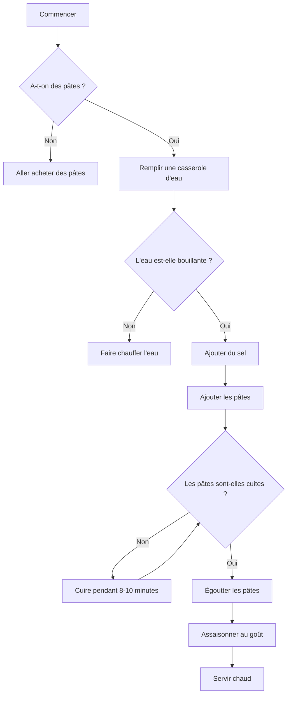

# TP Prise-en-main
## Evaluation compétences Packet Tracer
### Formation TAI
#### 2023/2024

---

**texte en gras**

texte qui n'est pas en gras


---

- Point

* Autre point

1. Encore autre point

---


---


---

```cli
Switch# configure terminal
Switch(config)# vlan 20
Switch(config-vlan)# name Gestion
```

`Exemple de code Powershell` :

```powershell
# Installer le rôle Active Directory Domain Services
Write-Host "Installation du rôle Active Directory Domain Services..."
Install-WindowsFeature -Name AD-Domain-Services -IncludeManagementTools -Restart


# Attendre le redémarrage du serveur
Write-Host "Attente du redémarrage du serveur..."
Start-Sleep -Seconds 30


# Renommer le serveur en "SRV-AD"
Write-Host "Renommage du serveur en SRV-AD..."
Rename-Computer -NewName "SRV-AD" -Force -Restart


# Attendre le redémarrage du serveur
Write-Host "Attente du redémarrage du serveur après le renommage..."
Start-Sleep -Seconds 10


# Définir les paramètres du domaine
$domainName = "mondomaine.local"
$adminUserName = "Admin"
$adminPassword = "M02p@ss3"


# Configurer le domaine Active Directory
Write-Host "Configuration du domaine Active-Directory..."
Install-ADDSForest -CreateDnsDelegation:$false -DatabasePath "C:\Windows\NTDS" -DomainNetBIOSName "MONDOMAINE" -DomainMode Win2012R2 -DomainName $domainName -DomainType ThreeDomainWholeForest -Force -LogPath "C:\Windows\NTDS" -NoRebootOnCompletion -SysvolPath "C:\Windows\SYSVOL" -SafeModeAdministratorPassword (ConvertTo-SecureString -AsPlainText $adminPassword -Force) -Verbose


# Attendre le redémarrage du serveur
Write-Host "Attente de la configuration du domaine..."
Start-Sleep -Seconds 20


# Créer l'unité d'organisation (OU "PC-Clients")
Write-Host "Création de l'unité d'organisation PC-Clients..."
New-ADOrganizationalUnit -Name "PC-Clients" -Path ("DC=" + ($domainName -split '\.' | Select-Object -First 2) -join ', DC=')


# Créer 10 utilisateurs avec le rôle administrateur pour les PC membres de l'OU "PC-Clients"
Write-Host "Création des utilisateurs et ajout aux PC-Clients..."
for ($i = 1; $i -le 10; $i++) {
    $userName = "User$i"
    $userPassword = ConvertTo-SecureString -String "M02p@ss3$i" -AsPlainText -Force
    $newUser = New-ADUser -Name $userName -AccountPassword $userPassword -UserPrincipalName $userPrincipal -Enabled $true -PassThru

    # Ajouter l'utilisateur au groupe "Administateurs du domaine"
    Add-ADPrincipalGroupMembership -Identity $newUser -Members "Admins du domaine"

    # Déplacer l'utilisateur vers l'OU "PC-Clients"
    Move-ADObject -Identity $newUser -TargetPath "OU=PC-Clients" + ($domainName
     -split '\.',2) [1].Replace('.','=')
}


Write-Host "La configuration du serveur Active Directory est terminée !"
```

---

- **Exemple schema mermaid**




---

# [Résumé](#résumé)